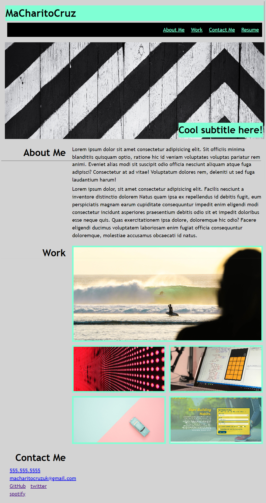
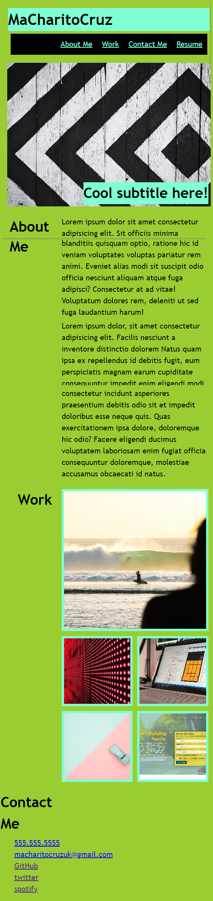
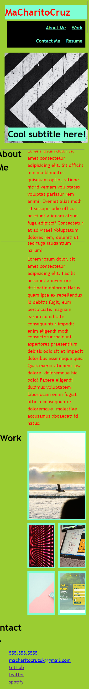

# My Portfolio

## Description
Portfolio webpage composed with the thing I have learned from Bootcamp.


## Table of Content
- About Me
- Work
- Contact Me
- Resume


## Visual

### Normal view of the website.


### Small viewport 450px background change to green.


### Small viewport 350px text change to red.



### Built with

- Media query
- Flexbox
- CSS Grid

### What I learned

To see how you can add code snippets, see below:

```Media query
@media screen and (max-width: 450px) {
  * {
    background-color: yellowgreen;
  }
}

```

```CSS Grid
.grid-templateAreas {
  display: grid;
  background-position: center;
  background-size: cover;
  background-repeat: no-repeat;
  cursor: pointer;
  border: 5px aquamarine solid;
  height: 380px;
}

```

```Flexbox
ul {
  display: flex;
  justify-content: flex-end;
  flex-wrap: wrap;
  background-color: black;
}

```

## Links

### Source code location
https://github.com/chari00/challenge-2 

### Website URL
https://chari00.github.io/My-Portfolio/ 

## License

This project is licensed by MIT.


